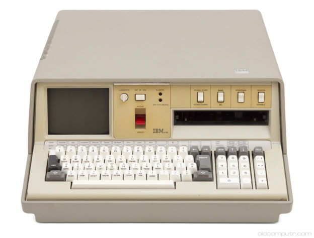

# COMPUTADORES I [(Google Drive)](https://drive.google.com/drive/u/0/folders/1LgPKoXnWQWU3c8u68ZZynr4HKGNsXhW2)

  

Pues eso.

## Teoría
  - [Clase](https://drive.google.com/open?id=1y5w0eFQYLPLx85sedizJE-4djR4KYnKx)
  
## Prácticas
  - [Sesión 1](https://drive.google.com/open?id=1WilbZpX-qZt4yvtEoo95TbL9BJEWkO3P)
    - [Soluciones](https://drive.google.com/open?id=13TTakzbZNendVsaWrxP36x9fBd1U3nTY)
  - [Sesión 2](https://drive.google.com/open?id=14dNNz2j6f5SPXaGLFTHoylz35kQwAxF4)
    - [Ejemplo Operaciones con Bits](https://drive.google.com/open?id=1WXAL7V8SMkpBgBL_5RZSp_hrN-3ZJ5Fa)
  - [Sesión 3](https://drive.google.com/open?id=1KXIZmW36iYQ6O103V8rQp7tcfeustoSh)
  - [Sesión 4](https://drive.google.com/open?id=1xvdRRyx7WJ1ET9kEocP56oTxRoXqt4l9)
  - [Sesión 5](https://drive.google.com/open?id=1VKTxThm1pCvSg-4qPQjBnOfCJwO9DLG8)
  - [Sesión 6](https://drive.google.com/open?id=1I-7dPfcou8dPjSaiUpCcK7f9HxXXYeWX)
  - [Sesión 7](https://drive.google.com/open?id=1ag-OScpMFGl4Vx6iLyVmgVUAcIXKjm4n)
    - [Sesión 7 Extra](https://drive.google.com/open?id=1ag-OScpMFGl4Vx6iLyVmgVUAcIXKjm4n)
  - [Sesión 8](https://drive.google.com/open?id=13c9hP_O19LWHGRvapL33bgJf3uDdWleA)
  - [Sesión 9](https://drive.google.com/open?id=1qA9gaXOxiZGYblWX0I1Q7u48IxXyH_0s)
  - [Sesión 10](https://drive.google.com/open?id=19VxKPrH-4ZhOhgYpsqwgnuCVBHcznTJ4)
  
## Presentación PowerPoint
  - [PowerPoint](https://drive.google.com/open?id=1tW-SjTJdhrknhA86oVGExZMLoPX13MTo)
  - [Guión](https://drive.google.com/open?id=11vI4B8PxPKsmAQ13zBlS8yfs5Jn-DZhx)
